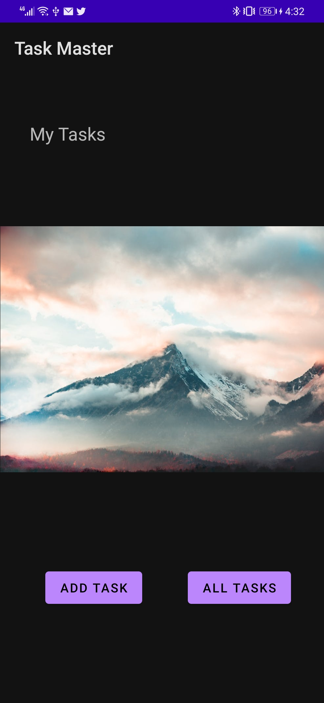
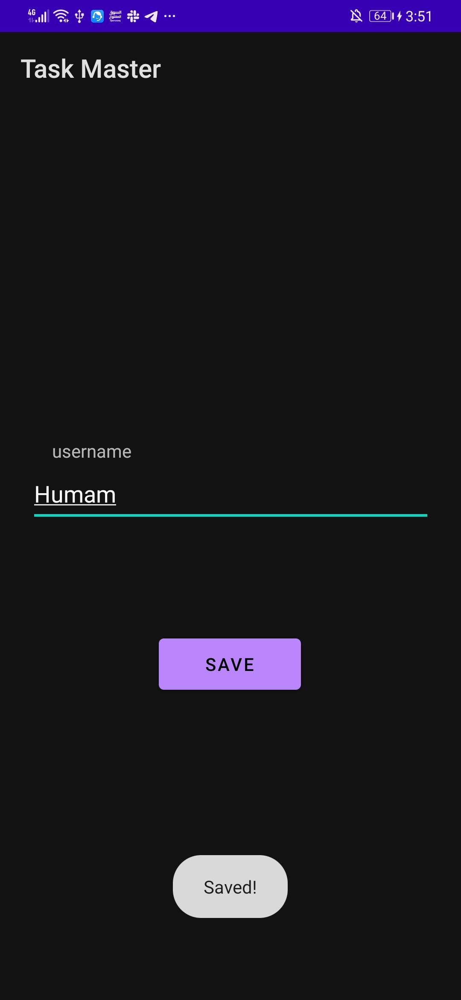
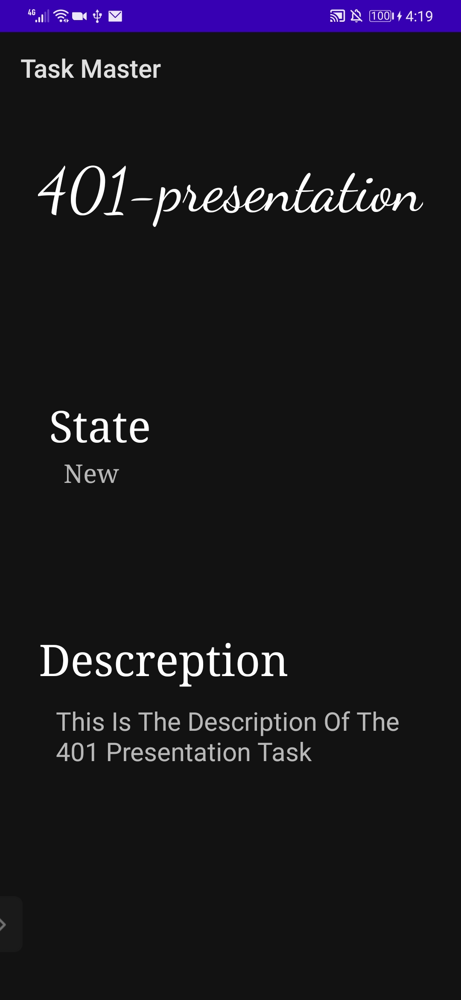
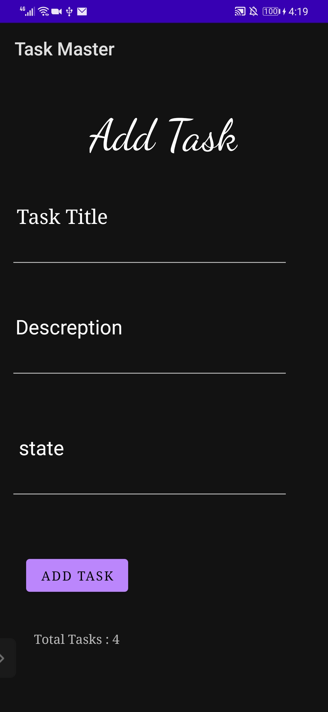
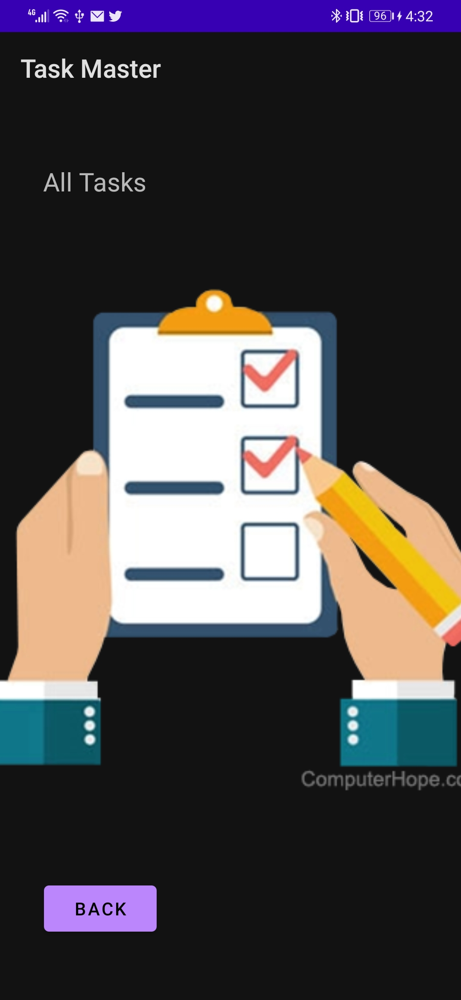

# taskmaster

this is an android application which allows the users to manage their tasks. 
version: 1.0.6

#### lab26 changelog:
+ create a home page which has a three tasks buttons and settings button and (add task , all tasks) buttons.
+ create an add task page which has two fields (title , descreption) and an add buttons which shows a message of submitted.
+ create an all tasks page which has an image and a back button to navigate you back to the home page.

#### lab27 changelog:
+ add a task details page which shows the task title and the descreption.
+ add a setting page which the user can change his username from there.

#### lab28 changelog:
+ add a recycle view to show the tasks dynamically in home page.

#### lab29 changelog:
+ a data base added, the data now is stored in the database.
+ added a click functionality on the tasks on main page to navigate you to task details page.
+ when adding a new task from add task page the task will be stored in the data base.

#### lab31 changelog:

+ added Espresso testing to the application.
+ testing for the buttons on home page of they have the proper naming.
+ testing the add task fuctionality and check if it apears in Main page.
+ testing the setting page changing username functionality and check if it apears on main page.
+ testing the all task page button and the back button inside.

#### lab32 changelog:

+ installed amplify service in the application.
+ change the database from the locally Room database , to the cloud database in the graphQL API.

#### lab33 changelog:

+ added three teams each team has its own tasks.
+ added the ability to choose which team when adding a task.
+ adding the ability to choose the team in the setting page.
+ the tasks in home page are the tasks belongs to the team choosen in the setting page.

#### lab36 changelog:

+ added cognito services to the application.
+ added a login and signup functionality.
+ when a user signed in , the username of him will be displayed in the home page.
+ added a signout button which sign the user out and calls the login functionality again.

#### lab37 changelog:

+ added s3 storage to the application.
+ added upload image functionality.
+ when navigating to task details page it will show the task image there.

#### lab38 changelog:

+ added a notification functionality.

#### lab41 changelog:

+ adding the ability to make new task from another applications by using the share text.

## here are some screens of the application
### the home page of the application:

### the settings page:

### the details page:

### the add task page:

### the all tasks page:

