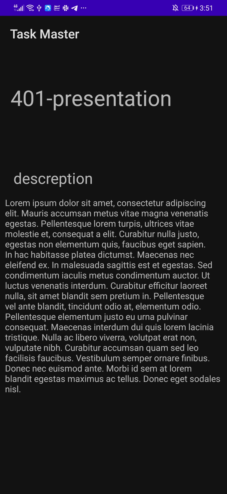

# taskmaster

this is an android application which allows the users to manage their tasks. 
version: 1.0.1

#### lab26 changelog:
+ create a home page which has a three tasks buttons and settings button and (add task , all tasks) buttons.
+ create an add task page which has two fields (title , descreption) and an add buttons which shows a message of submitted.
+ create an all tasks page which has an image and a back button to navigate you back to the home page.

#### lab27 changelog:
+ add a task details page which shows the task title and the descreption.
+ add a setting page which the user can change his username from there.

## here are some screens of the application

### the home page of the application:

### the settings page:

### the details page:

### the add task page:

### the all tasks page:

